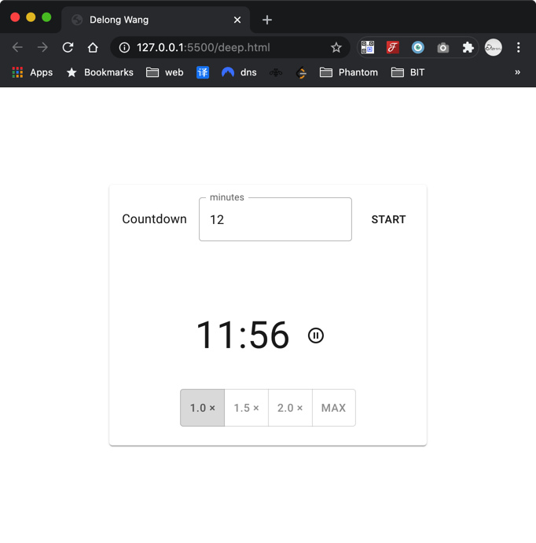
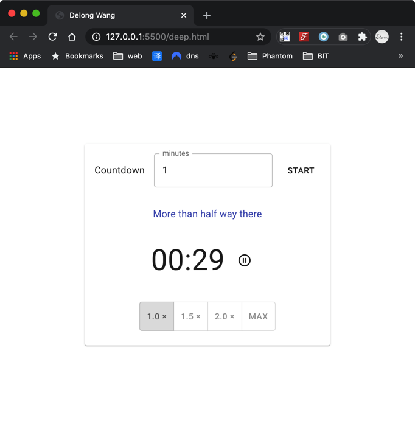
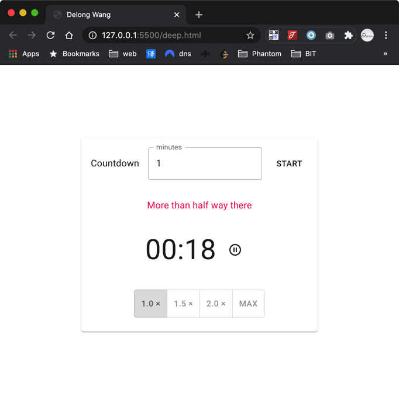
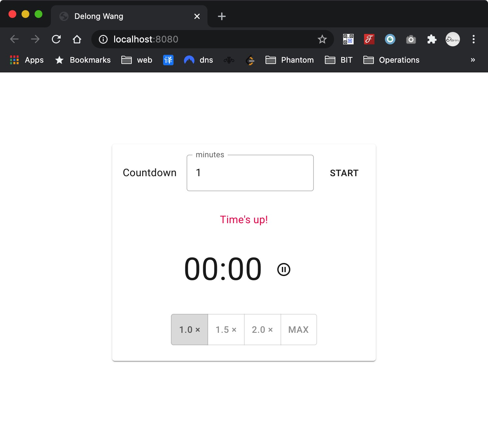

# Deep Solution

### Task 1

Usage

download this repo, and open terminal

```shell
cd repo/task-1
npm start
```

then, it will open browser automatically

Screenshots

-   start to counting



-   half seconds left



-   20 seconds



-   time up



### Task 2

Usage

download this repo, and open terminal

```shell
cd REPO/task-2
npm i
npm start
```

and the simpler way is using docker:

```shell
docker pull delongw/deep:0.2
```